# 扑克战绩跟踪器 - 用户操作流程图

## 1. 核心用户旅程

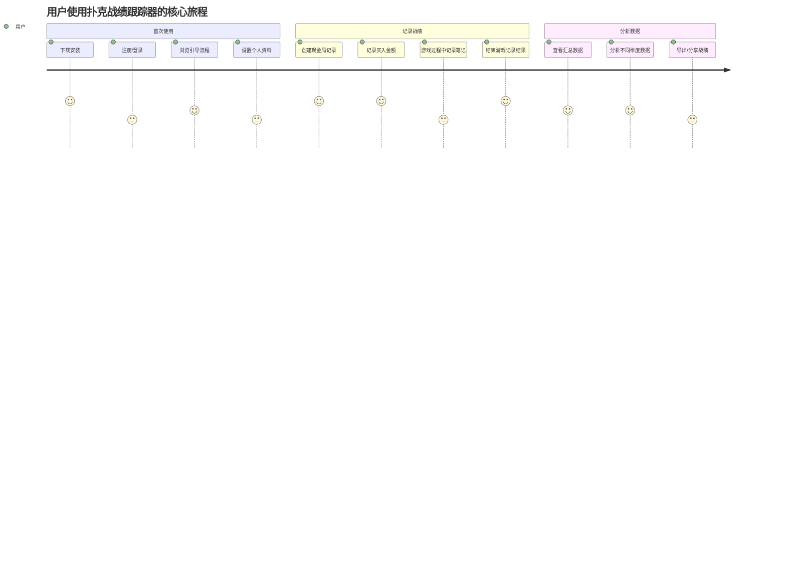

## 2. 详细用户流程图

### 2.1 注册与登录流程

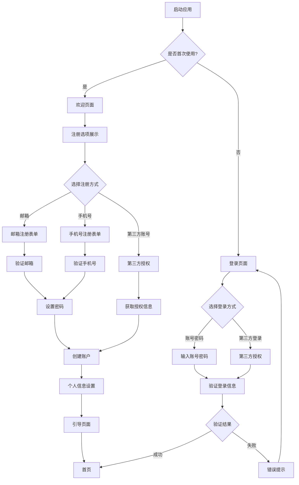

### 2.2 现金局记录流程

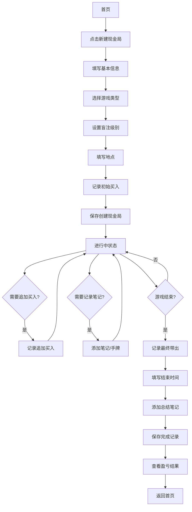

### 2.3 锦标赛记录流程

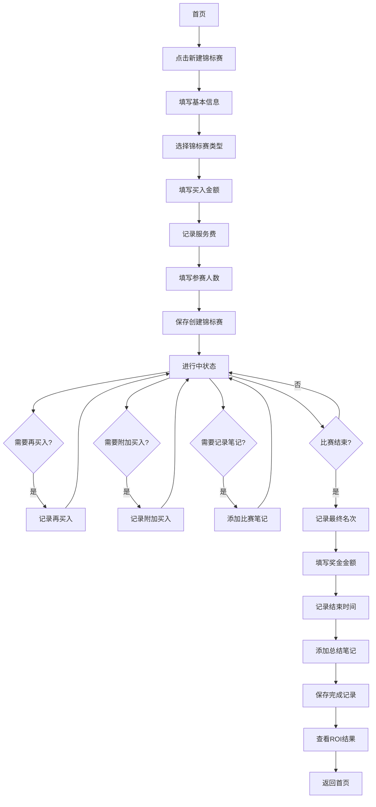

### 2.4 数据分析流程

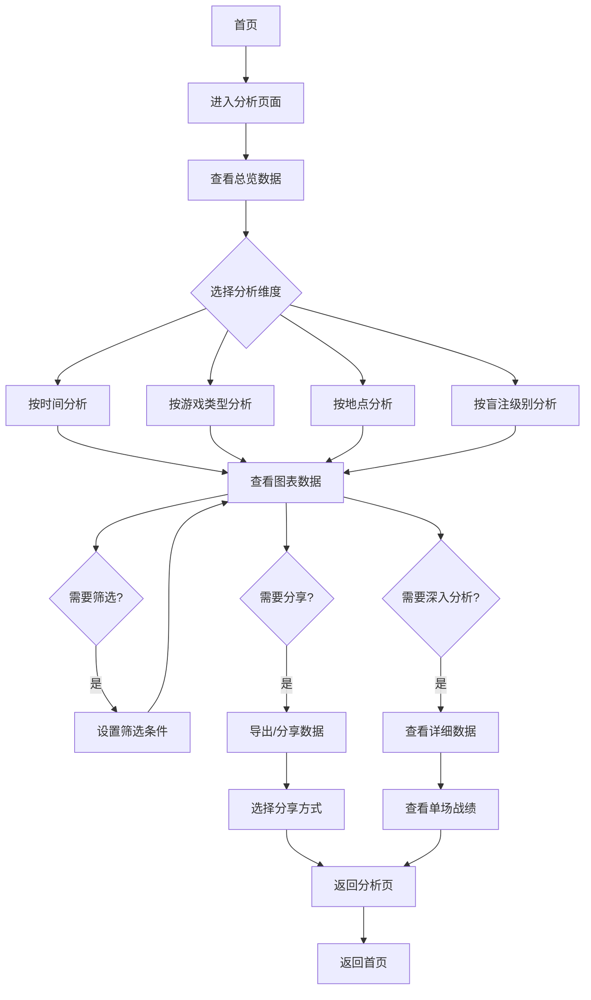

### 2.5 设置与配置流程

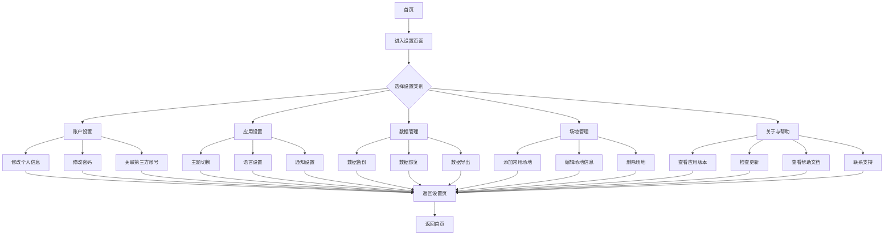

## 3. 关键用户任务流程

### 3.1 快速记录流程

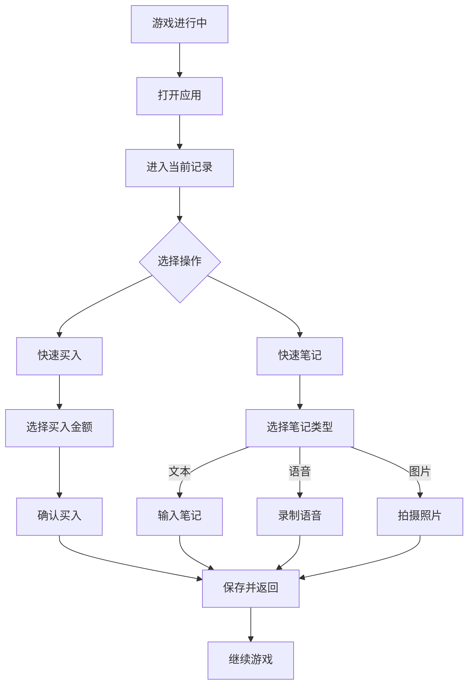

### 3.2 分享战绩流程

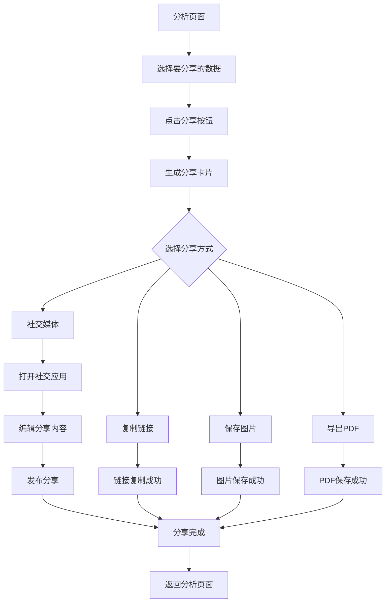

## 4. 错误处理流程

### 4.1 网络错误处理

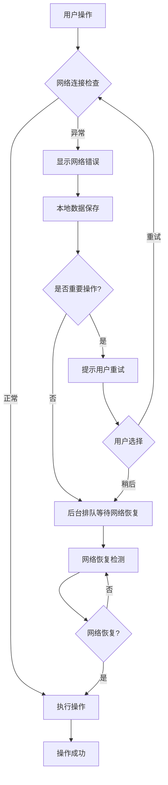

### 4.2 数据同步冲突处理

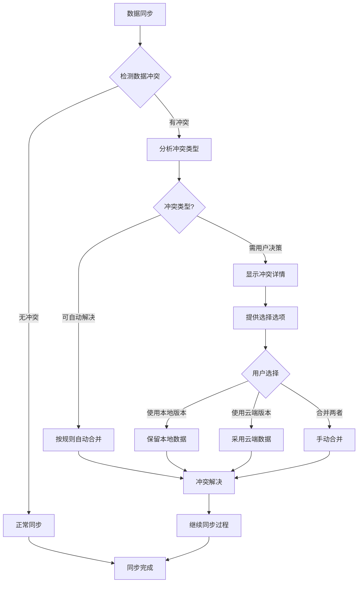

## 5. 关键状态转换

### 5.1 记录状态转换

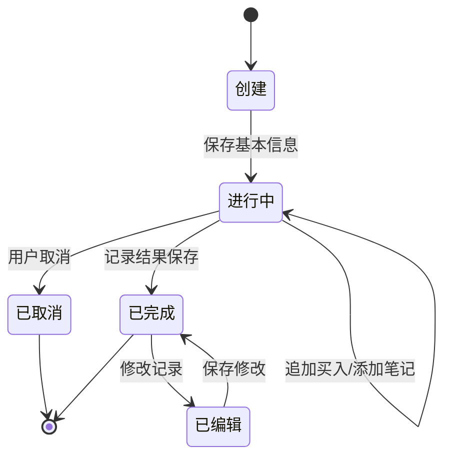

### 5.2 用户状态转换

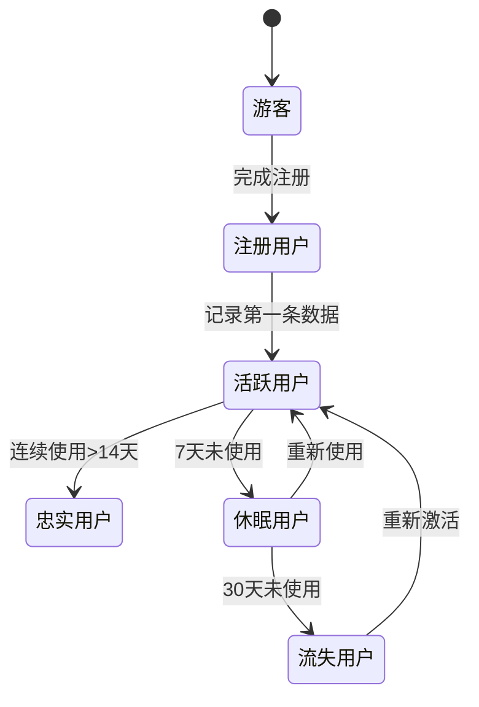