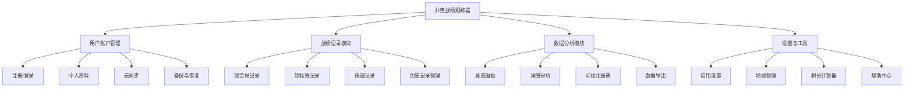
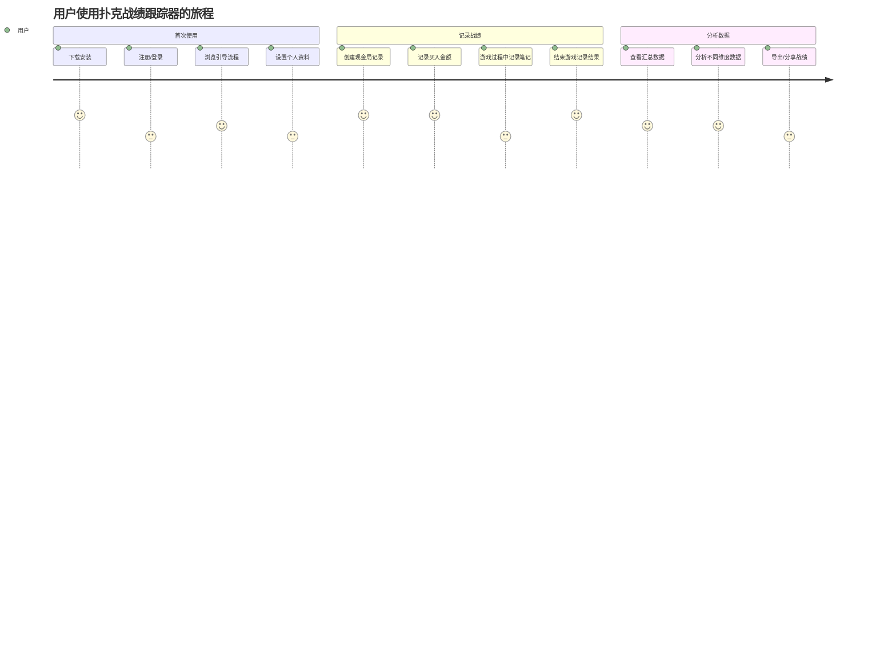
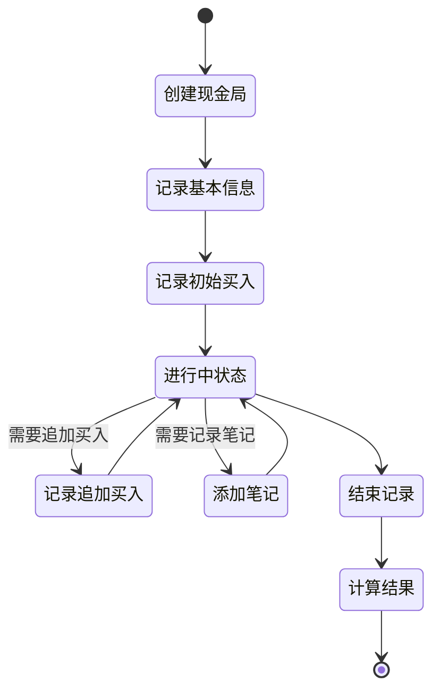
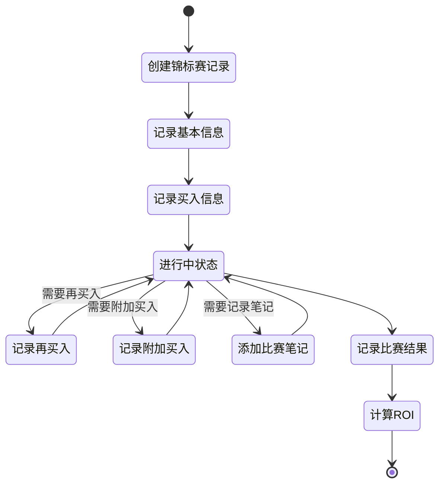
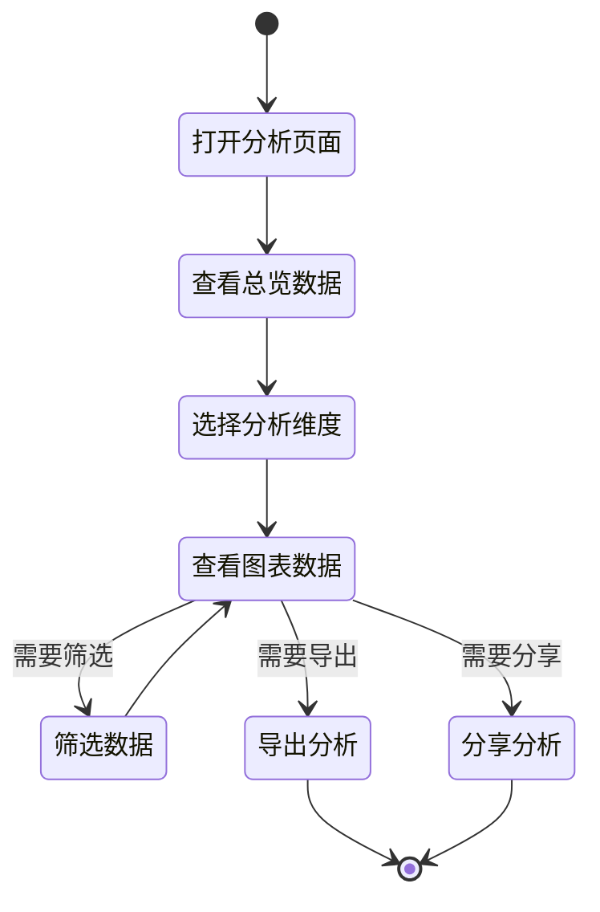
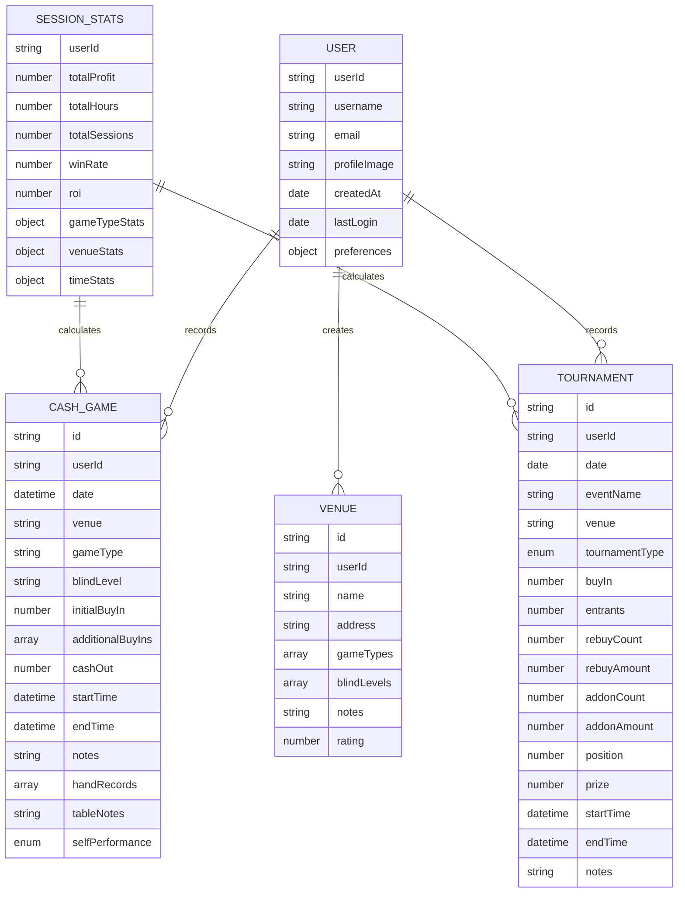

# 扑克战绩跟踪器 - 产品需求文档 (PRD)

## 1. 文档信息

### 1.1 版本历史
| 版本 | 日期 | 修改人 | 修改说明 |
|------|------|--------|----------|
| v1.0 | 2023-05-19 | 产品团队 | 初始版本 |

### 1.2 文档目的
本文档详细描述"扑克战绩跟踪器"的产品需求，作为设计、开发和测试团队的工作指导依据。

### 1.3 相关文档引用
- 产品路线图 (`docs/Roadmap.md`)
- 用户故事地图 (`docs/User_Story_Map.md`)
- 产品评估指标框架 (`docs/Metrics_Framework.md`)

## 2. 产品概述

### 2.1 产品名称与定位
- 产品名称：**扑克战绩跟踪器**（暂定名，英文名：Poker Tracker Pro）
- 产品定位：专业的德州扑克战绩记录与分析工具，面向德州扑克现金局和锦标赛玩家，帮助用户追踪和分析其扑克游戏表现。

### 2.2 产品愿景与使命
**愿景**：成为扑克玩家必备的战绩管理和分析平台，帮助他们提升游戏表现和决策能力。

**使命**：通过提供直观、便捷的战绩记录与分析工具，帮助不同水平的扑克玩家更好地理解自己的游戏模式，发现优势和劣势，以数据驱动方式提升游戏水平。

### 2.3 价值主张与独特卖点(USP)
- **无缝战绩记录**：快速录入各类型扑克游戏数据，包括现金局和锦标赛
- **专业数据分析**：提供全面的统计和视觉化分析工具，呈现用户游戏表现
- **简洁精美界面**：直观优雅的用户界面，操作流畅，视觉体验佳
- **跨平台兼容性**：支持iOS、Android，并预留鸿蒙平台支持的扩展能力

### 2.4 目标平台列表
- iOS 13.0+
- Android 8.0+
- 鸿蒙OS (HarmonyOS) 2.0+

### 2.5 产品核心假设
1. 用户希望以数字化方式记录和分析其扑克游戏战绩，取代传统纸笔或通用记事本应用
2. 用户愿意在游戏前后花时间记录战绩数据
3. 数据分析和图表展示能为用户提供真正的游戏洞察
4. 简洁直观的用户体验比功能复杂性更重要

### 2.6 商业模式概述
初期作为免费应用，专注于用户增长和产品完善。随用户规模扩大，将引入：
- 基础广告：非侵入式横幅广告
- 高级会员：提供高级分析功能、无广告体验
- 专业插件：针对专业/半职业玩家的高级功能模块

## 3. 用户研究

### 3.1 目标用户画像

#### 3.1.1 休闲娱乐型玩家
- **人口统计特征**：25-45岁，男性为主，中高收入，从事各行各业
- **行为习惯与偏好**：
  - 每月参与1-4次德州扑克局
  - 主要在朋友聚会或非正规俱乐部参与游戏
  - 重视游戏社交性，但也期望提升水平
  - 习惯使用智能手机记录日常事务
- **核心需求与痛点**：
  - 需求：简单记录游戏结果，了解长期盈亏情况
  - 痛点：难以持续记录和汇总游戏数据，无法客观评估自己的表现
- **动机与目标**：
  - 确认自己是赢家还是输家
  - 跟踪游戏进步情况
  - 了解在不同场合的表现差异

#### 3.1.2 认真爱好者
- **人口统计特征**：22-50岁，男性为主，中高收入，部分有技术或分析背景
- **行为习惯与偏好**：
  - 每周参与2-5次德州扑克局
  - 经常在扑克俱乐部或赌场参与游戏
  - 阅读扑克策略书籍和文章，观看教学视频
  - 熟悉常见扑克术语和指标
- **核心需求与痛点**：
  - 需求：详细记录游戏数据，分析不同游戏类型和场合的表现
  - 痛点：现有记录方式无法进行多维度分析，难以识别最具盈利性的游戏类型和地点
- **动机与目标**：
  - 系统化提升游戏水平
  - 识别最适合自己的游戏类型和场合
  - 量化分析自己的扑克投资回报率

#### 3.1.3 职业/半职业牌手
- **人口统计特征**：20-40岁，男性为主，以扑克为主要或部分收入来源
- **行为习惯与偏好**：
  - 几乎每天都参与扑克游戏
  - 同时参加线上和线下比赛
  - 严格管理扑克投资和收入
  - 非常重视数据和统计分析
- **核心需求与痛点**：
  - 需求：专业级数据记录和分析，详细的财务和表现追踪
  - 痛点：难以整合和分析来自不同平台和场合的数据，缺乏便携的综合记录工具
- **动机与目标**：
  - 精确分析游戏表现和盈利能力
  - 税务和收入管理
  - 识别并优化薄弱环节
  - 评估不同投资（如锦标赛选择）的ROI

### 3.2 用户场景分析

#### 3.2.1 核心使用场景

**场景1：现金局前准备**
> 张先生计划晚上去朋友家参加$1/$2的现金局。他打开应用创建新现金局记录，输入基本信息（地点、日期、游戏类型、盲注级别），准备记录即将开始的游戏。

**场景2：现金局中记录买入**
> 李女士在俱乐部参加$2/$5现金局，初始买入$500。在游戏过程中，她追加买入$300。她快速打开应用，在当前进行中的现金局记录中添加这笔追加买入。

**场景3：锦标赛结束记录**
> 王先生刚结束一场$200+$20买入的MTT锦标赛，获得第3名，奖金$2,400。比赛中他进行了1次重买。他打开应用，完成锦标赛记录，填写名次、奖金、重买信息和比赛时长。

**场景4：周末回顾分析**
> 周先生周末有空，想回顾自己过去一个月的扑克表现。他打开应用的分析页面，查看按游戏类型、地点和时间段的盈亏分布，发现自己在PLO游戏中亏损明显，而在低级别NLH现金局中盈利良好。

**场景5：分享战绩**
> 刘女士在过去一周的扑克比赛中表现出色，想与朋友分享。她在应用中选择过去7天的战绩报告，生成可分享的图表，通过社交媒体分享给朋友圈。

#### 3.2.2 边缘使用场景

**场景1：多人游戏记录**
> 4位朋友共同参加一个私人俱乐部的现金局，约定共同记录并分析数据。一位用户创建游戏记录并邀请其他人查看或编辑。

**场景2：回溯添加历史数据**
> 新用户安装应用后，希望导入过去3个月手动记录在电子表格中的战绩数据，以便进行完整分析。

**场景3：长时间会话暂停与恢复**
> 用户参加为期3天的扑克周末赛事，需要在不同时间段记录多场比赛，并在赛事结束后进行综合分析。

**场景4：无网络环境记录**
> 用户在没有网络连接的环境（如某些赌场内部）需要记录游戏数据，希望能在恢复连接后同步到云端。

### 3.3 用户调研洞察

基于目标用户需求与现有解决方案的分析，我们得出以下关键洞察：

1. **简化优先**：大多数用户希望尽可能快速地记录基本数据，复杂的输入会降低持续使用意愿
2. **分析价值**：用户最看重的是能够看到自己在不同条件下（游戏类型、场地、时间段）的表现差异
3. **可视化需求**：直观的图表和数据可视化是用户评估自身表现的首选方式
4. **隐私考量**：用户对敏感财务数据有保密需求，应提供良好的数据保护和隐私控制
5. **记录连续性**：确保用户能持续记录的关键是降低每次记录的摩擦，提供足够的激励机制 

## 4. 市场与竞品分析

### 4.1 市场规模与增长预测

全球扑克玩家数量估计超过1亿，其中约15-20%为经常性参与者。移动应用使用场景：

- **休闲扑克玩家市场**：全球约5000-8000万人，每年增长率3-5%
- **认真爱好者市场**：全球约1000-1500万人，每年增长率6-8%
- **职业/半职业玩家**：全球约50-100万人，相对稳定

德州扑克仍然是最流行的扑克变种，占整体扑克活动的65-70%。移动应用使用渗透率在扑克玩家中约为30-40%，每年增长10-15%。

### 4.2 行业趋势分析

1. **数据驱动决策**：扑克玩家越来越依赖数据分析来提升技能，专业分析工具需求上升
2. **移动化趋势**：从桌面软件向移动应用迁移，随时随地记录和分析的需求增加
3. **社交化扑克**：扑克作为社交活动的流行度上升，分享和比较战绩的需求增加
4. **合规与隐私**：对应用的隐私保护和合规性要求提高（特别是涉及金融数据时）
5. **跨平台需求**：用户希望在不同设备间无缝使用应用的需求增强

### 4.3 竞争格局分析

#### 4.3.1 直接竞争对手

**Poker Income Tracker**
- **优势**：专注扑克数据记录，界面简洁，基本分析功能完善
- **劣势**：视觉设计陈旧，高级分析能力有限，缺乏社交功能
- **定价**：基础版免费，专业版$9.99/月
- **市场份额**：扑克记录类应用市场约15-20%

**PokerTracker Mobile**
- **优势**：知名品牌，强大的数据分析能力，与桌面版集成良好
- **劣势**：界面复杂，学习曲线陡峭，价格较高
- **定价**：$59.99一次性购买，附加订阅服务
- **市场份额**：扑克记录类应用市场约20-25%

**Poker Manager**
- **优势**：全面的锦标赛管理功能，适合职业玩家
- **劣势**：偏重锦标赛而非现金局，移动版功能较受限
- **定价**：免费基础版，专业版$4.99/月
- **市场份额**：扑克记录类应用市场约10-15%

#### 4.3.2 间接竞争对手

**通用记账应用**：如Money Manager, YNAB
- 优势是用户基础大，界面友好；劣势是缺乏扑克特定功能

**电子表格应用**：如Microsoft Excel, Google Sheets
- 优势是高度自定义；劣势是使用复杂，缺乏移动友好性

**纸质记录**：传统笔记本、扑克专用记录本
- 优势是使用简单直接；劣势是无法进行数据分析和长期追踪

### 4.4 竞品功能对比矩阵

| 功能/应用 | 我们的应用 | Poker Income | PokerTracker | Poker Manager |
|-----------|------------|--------------|--------------|---------------|
| 现金局记录 | ✓✓✓ | ✓✓ | ✓✓✓ | ✓ |
| 锦标赛记录 | ✓✓✓ | ✓✓ | ✓✓ | ✓✓✓ |
| 数据可视化 | ✓✓✓ | ✓ | ✓✓✓ | ✓✓ |
| 多维度分析 | ✓✓ | ✓ | ✓✓✓ | ✓ |
| UI/UX设计 | ✓✓✓ | ✓ | ✓ | ✓✓ |
| 离线使用 | ✓✓✓ | ✓✓ | ✓ | ✓✓ |
| 社交分享 | ✓✓ | ✗ | ✓ | ✓ |
| 跨平台支持 | ✓✓✓ | ✓✓ | ✓ | ✓✓ |
| 数据导出 | ✓✓ | ✓ | ✓✓✓ | ✓ |
| 价格合理性 | ✓✓✓ | ✓✓ | ✓ | ✓✓ |

*注: ✓ = 基本支持, ✓✓ = 良好支持, ✓✓✓ = 卓越支持, ✗ = 不支持*

### 4.5 市场差异化策略

基于市场分析，我们的差异化策略包括：

1. **用户体验优先**：相比竞品，提供更简洁、直观且视觉精美的界面设计
2. **快速记录流程**：优化记录流程，让用户能在30秒内完成一次基本记录
3. **平衡分析深度**：提供足够专业的分析功能，但避免过度复杂，适合各级玩家
4. **全平台战略**：同时覆盖iOS、Android和鸿蒙平台，满足中国市场特殊需求
5. **社交功能增强**：加强战绩分享功能，促进用户间互动和持续使用 

## 5. 产品功能需求

### 5.1 功能架构与模块划分

产品功能架构如下图所示：

### 5.2 核心功能详述

#### 5.2.1 用户账户管理

##### 注册与登录
- **功能描述**：作为新用户，我希望能快速注册账户并登录应用，以便保存和访问我的战绩数据。
- **用户价值**：提供数据安全存储和跨设备访问的基础。
- **功能逻辑**：
  - 支持手机号、邮箱和第三方平台（Google/Apple/微信）登录
  - 简化注册流程，最少信息量原则
  - 本地缓存登录状态，避免频繁登录
- **交互要求**：
  - 登录界面简洁明了，突出第三方快速登录选项
  - 登录过程不超过2个步骤
- **数据需求**：
  - 用户基本信息（用户名、联系方式、密码）
  - 登录记录和设备信息
- **技术依赖**：
  - 第三方登录SDK集成
  - 安全加密传输
- **验收标准**：
  - 用户可在30秒内完成注册或登录过程
  - 支持无网络环境下使用本地模式
  - 账户信息安全存储，符合数据保护规范

##### 云同步
- **功能描述**：作为用户，我希望我的数据能自动同步到云端，以便在不同设备上访问和避免数据丢失。
- **用户价值**：保障数据安全，提供跨设备使用体验。
- **功能逻辑**：
  - 自动后台同步，定期和触发式结合
  - 支持选择性同步和仅WIFI下同步
  - 冲突解决策略：时间戳优先，提供冲突通知
- **交互要求**：
  - 同步状态指示器，清晰展示同步进度
  - 同步设置简单易懂
- **数据需求**：
  - 增量同步机制，减少数据传输
  - 同步状态记录
- **验收标准**：
  - 在正常网络环境下，新数据在30秒内完成同步
  - 网络中断后能自动恢复同步
  - 数据冲突时提供用户选择机制

#### 5.2.2 现金局记录

- **功能描述**：作为扑克玩家，我希望能详细记录现金局的所有相关信息，以便追踪我的扑克投资和表现。
- **用户价值**：提供现金局游戏的完整记录和分析基础。
- **功能逻辑**：
  - 基本信息记录：日期、地点、游戏类型、盲注级别
  - 买入记录：初始买入、追加买入（带时间记录）
  - 结束记录：最终带出筹码、游戏时长
  - 笔记功能：记录重要手牌、桌面情况等
- **交互要求**：
  - 表单设计简洁，大部分字段提供快速选择
  - 最常用功能（买入记录、结束记录）一键直达
  - 支持语音输入笔记
- **数据需求**：
  - 现金局记录结构设计
  - 常用地点、游戏类型等历史记录
- **验收标准**：
  - 用户能在30秒内创建基本现金局记录
  - 能准确计算盈亏和时间投资
  - 支持编辑历史记录

##### 现金局详细记录字段

| 字段名称 | 字段类型 | 是否必填 | 描述 |
|---------|---------|---------|------|
| 日期时间 | DateTime | 是 | 游戏日期和开始时间 |
| 地点 | String | 是 | 游戏场所 |
| 游戏类型 | Enum | 是 | NLH/PLO/混合游戏等 |
| 盲注级别 | String | 是 | 小盲/大盲金额 |
| 初始买入 | Number | 是 | 首次买入金额 |
| 追加买入 | Array<{amount, time}> | 否 | 追加买入金额和时间 |
| 最终带出 | Number | 是(结束时) | 离场时的筹码金额 |
| 开始时间 | Time | 是 | 游戏开始时间 |
| 结束时间 | Time | 是(结束时) | 游戏结束时间 |
| 备注笔记 | Text | 否 | 游戏相关笔记 |
| 手牌记录 | Array<Object> | 否 | 值得记录的关键手牌 |
| 桌面特点 | Text | 否 | 桌面风格和玩家特点描述 |
| 自我表现 | Enum | 否 | 主观评价自己的表现 |

#### 5.2.3 锦标赛记录

- **功能描述**：作为扑克玩家，我希望记录我参加的各类锦标赛详情，以便追踪我的比赛表现和投资回报。
- **用户价值**：提供锦标赛完整记录，支持ROI和表现分析。
- **功能逻辑**：
  - 比赛信息：日期、地点、赛事名称、比赛类型（MTT/SNG）
  - 费用记录：买入费用、再买入/附加买入次数和金额
  - 结果记录：名次、奖金、淘汰时间
  - 比赛笔记：关键手牌、观察等
- **交互要求**：
  - 表单逻辑分组，根据比赛类型显示相关字段
  - 提供常见比赛模板，如常规周赛等
- **数据需求**：
  - 锦标赛记录数据结构
  - 比赛类型和结构定义
- **验收标准**：
  - 支持各类主流锦标赛格式记录
  - 准确计算ROI和投资回报
  - 记录流程直观高效

##### 锦标赛详细记录字段

| 字段名称 | 字段类型 | 是否必填 | 描述 |
|---------|---------|---------|------|
| 日期 | Date | 是 | 比赛日期 |
| 赛事名称 | String | 是 | 锦标赛名称 |
| 地点 | String | 是 | 比赛场所 |
| 比赛类型 | Enum | 是 | MTT/SNG/Satellite等 |
| 买入金额 | Number | 是 | 包括报名费和服务费 |
| 参赛人数 | Number | 否 | 总参赛人数 |
| 再买入次数 | Number | 否 | 重买次数 |
| 再买入金额 | Number | 否 | 重买总金额 |
| 附加买入次数 | Number | 否 | Add-on次数 |
| 附加买入金额 | Number | 否 | Add-on总金额 |
| 最终名次 | Number | 是(结束时) | 比赛最终排名 |
| 奖金 | Number | 否 | 获得的奖金金额 |
| 开始时间 | Time | 否 | 比赛开始时间 |
| 结束时间 | Time | 否 | 结束或淘汰时间 |
| 比赛笔记 | Text | 否 | 比赛相关记录和观察 |

#### 5.2.4 数据分析与可视化

- **功能描述**：作为扑克玩家，我希望查看我的游戏数据分析和可视化图表，以便了解我的表现趋势和改进方向。
- **用户价值**：提供数据驱动的游戏洞察，支持决策优化。
- **功能逻辑**：
  - 总览分析：总盈亏、场次、时间投入、平均表现等
  - 多维分析：按游戏类型、地点、时间段、盲注级别等维度分析
  - 趋势分析：展示不同时间尺度（日/周/月/年）的表现变化
  - 关键指标：计算ROI、每小时收益率、盈利场次比例等
- **交互要求**：
  - 图表交互式，支持钻取和筛选
  - 视觉呈现专业美观
  - 支持自定义分析维度
- **数据需求**：
  - 统计计算逻辑
  - 历史数据聚合机制
- **验收标准**：
  - 图表加载速度快（<2秒）
  - 数据计算准确
  - 支持至少5种不同维度的分析视角

##### 核心分析指标

| 指标名称 | 计算公式 | 应用场景 |
|---------|---------|---------|
| 总盈亏 | 所有游戏盈亏总和 | 总体表现评估 |
| 场均盈亏 | 总盈亏/场次 | 单场表现均值 |
| 每小时收益 | 总盈亏/总游戏时长 | 时间投资回报 |
| BB/小时 | (总盈亏/大盲金额)/总游戏时长 | 技术水平评估 |
| ROI | (总奖金-总买入)/总买入*100% | 锦标赛投资回报 |
| 盈利场次比例 | 盈利场次/总场次*100% | 稳定性评估 |
| 投入资金回报率 | 总盈亏/总投入*100% | 整体投资回报 |

#### 5.2.5 快速记录

- **功能描述**：作为扑克玩家，我希望在游戏进行中能快速记录买入和关键信息，以便不打断游戏体验。
- **用户价值**：降低记录摩擦，提高记录完整性。
- **功能逻辑**：
  - 快速买入记录：一键记录追加买入
  - 语音笔记：快速添加语音记录，稍后转文字
  - 快照笔记：拍照记录关键牌局或筹码情况
- **交互要求**：
  - 极简界面，大按钮设计
  - 操作步骤最少化
  - 支持锁屏状态快速访问
- **数据需求**：
  - 临时数据存储
  - 多媒体内容处理
- **验收标准**：
  - 从解锁到完成记录不超过5秒
  - 支持后台运行和推送提醒
  - 数据准确合并到主记录中

### 5.3 次要功能描述

#### 5.3.1 场地管理
- 支持创建和管理常用游戏场地
- 场地信息包括：名称、地址、游戏类型、常见盲注等
- 支持为场地添加评价和笔记

#### 5.3.2 积分计算器
- 提供筹码和现金换算功能
- 支持分配团队游戏的盈亏
- 计算常见锦标赛结构的奖励分配

#### 5.3.3 数据导出与分享
- 支持导出数据为CSV/Excel格式
- 生成精美的战绩报告卡片，便于社交媒体分享
- 支持与指定好友分享战绩数据

#### 5.3.4 目标设定与追踪
- 允许用户设定收益目标（如月度/年度目标）
- 追踪目标完成进度
- 提供目标达成提醒和鼓励

### 5.4 未来功能储备 (Backlog)

#### 优先级P1
1. **手牌分析工具**：记录和分析特定牌局情况
2. **社区功能**：用户间交流和战绩比较
3. **锦标赛结构库**：提供常见锦标赛结构模板

#### 优先级P2
1. **AI辅助分析**：基于记录数据提供游戏改进建议
2. **多设备同步优化**：支持离线编辑和冲突智能解决
3. **高级数据可视化**：更专业的数据展示和分析工具

#### 优先级P3
1. **扑克学习资源整合**：策略文章和视频推荐
2. **线上游戏集成**：与主流线上扑克平台数据对接
3. **团队功能**：支持牌手团队共享数据和分析 

## 6. 用户流程与交互设计指导

### 6.1 核心用户旅程地图

以下展示了用户使用应用的主要旅程流程：

### 6.2 关键流程详述与状态转换图

#### 6.2.1 现金局记录流程

#### 6.2.2 锦标赛记录流程

#### 6.2.3 数据分析流程

### 6.3 对设计师 (UI/UX Agent) 的界面原型参考说明和要求

#### 6.3.1 总体设计风格

- **风格定位**：专业、简洁、现代
- **配色方案**：
  - 主色调：深蓝色系 (#1E3A8A)，象征专业和可靠
  - 辅助色：绿色 (#10B981) 表示盈利，红色 (#EF4444) 表示亏损
  - 中性色：浅灰 (#F3F4F6) 到深灰 (#4B5563)的渐变
- **排版指南**：
  - 应用内统一使用无衬线字体
  - 标题粗体，主体内容常规字重
  - 数据重点使用加粗或较大字号
- **设计语言**：遵循 Material Design 3 / iOS Human Interface Guidelines 的设计语言，以确保在不同平台的一致性体验

#### 6.3.2 关键页面设计指导

**首页仪表盘**
- 顶部显示总盈亏和关键指标
- 中部使用图表展示趋势数据
- 底部显示最近游戏记录
- 悬浮按钮用于快速创建新记录

**现金局记录表单**
- 采用分步设计，避免一次显示过多字段
- 最常用字段放在首屏
- 提供快速输入选项（如常用地点、游戏类型）
- 使用明确的视觉层次区分必填和选填项

**数据分析页面**
- 提供多个分析选项卡，每个专注于一类分析
- 图表设计简洁，避免过度装饰
- 提供交互式筛选器，便于用户快速调整视图
- 为不同数据状态（无数据、加载中、错误）提供明确的视觉反馈

**快速记录界面**
- 大按钮设计，便于游戏中快速操作
- 最小化输入步骤
- 支持手势操作
- 针对夜间场景优化（暗色主题）

#### 6.3.3 重点交互设计要求

1. **表单交互**：
   - 使用输入辅助功能（如日期选择器、预填充历史数据）
   - 实时验证，即时反馈
   - 保存草稿功能，防止意外丢失

2. **图表交互**：
   - 支持缩放、平移、长按查看详情
   - 提供图表类型切换（柱状图、折线图、饼图等）
   - 包含图例和数据标签

3. **导航设计**：
   - 底部标签栏包含：首页、记录、分析、我的
   - 使用明确的图标和标签
   - 提供上下文感知导航（如从记录直接跳转到相关分析）

#### 6.3.4 设计注意事项

1. **可访问性考量**：
   - 确保文本对比度符合WCAG标准
   - 支持字体大小调整
   - 提供替代文本和标签
   - 考虑色盲用户的色彩区分

2. **响应式设计**：
   - 优化不同尺寸设备的布局
   - 考虑横屏和竖屏模式
   - 优先展示核心功能和数据

3. **空状态与首次使用体验**：
   - 为无数据状态设计引导性界面
   - 提供示例数据展示应用潜力
   - 简明的引导流程帮助用户快速上手

### 6.4 交互设计规范与原则建议

1. **简化原则**：每个页面聚焦于单一主要任务，避免过度复杂
2. **一致性原则**：在整个应用中保持一致的界面元素和交互模式
3. **反馈原则**：为所有用户操作提供明确的视觉或触觉反馈
4. **错误预防原则**：设计界面以预防用户错误，而非仅仅处理错误
5. **效率原则**：优化常用流程，减少点击和输入步骤
6. **灵活性原则**：为不同用户需求提供定制选项，但不过度复杂化界面
7. **可发现性原则**：确保功能易于发现，避免隐藏重要功能

## 7. 非功能需求

### 7.1 性能需求

| 需求类别 | 具体需求 | 验收标准 |
|---------|---------|---------|
| 启动时间 | 冷启动应用 | ≤ 3秒（在中端设备上） |
| 页面加载时间 | 主要界面加载 | ≤ 1秒 |
| 数据操作响应时间 | 创建/编辑记录 | ≤ 0.5秒 |
| 图表渲染时间 | 统计图表展示 | ≤ 2秒（1000条记录以内） |
| 后台同步 | 数据云同步 | 不对前台操作造成明显延迟 |
| 内存占用 | 运行时内存 | ≤ 200MB |
| 存储占用 | 应用安装大小 | ≤ 50MB（不含用户数据） |
| 电池消耗 | 前台使用1小时 | ≤ 5%电量（标准设备） |
| | 后台运行1小时 | ≤ 1%电量 |
| 离线操作 | 应用功能可用性 | 除云同步外所有功能在离线状态可用 |

### 7.2 安全需求

| 需求类别 | 具体需求 | 实现措施 |
|---------|---------|---------|
| 数据存储安全 | 本地数据加密 | 使用业界标准加密算法（如AES-256）加密本地存储 |
| 数据传输安全 | 网络传输加密 | 使用HTTPS/TLS 1.3，禁用不安全协议 |
| 用户认证 | 安全的用户认证机制 | 支持双因素认证，密码强度验证 |
| 授权与访问控制 | 敏感操作保护 | 重要操作需二次确认，适当使用生物识别认证 |
| 数据备份 | 数据安全备份 | 提供自动和手动备份选项，支持加密备份 |
| 隐私保护 | 用户隐私数据处理 | 符合GDPR和当地数据隐私法规要求 |
| | 隐私选项控制 | 允许用户控制数据分享和可见性 |
| 第三方集成安全 | 第三方服务使用 | 严格审核第三方SDK，最小化数据访问范围 |
| 安全更新 | 安全漏洞修复 | 安全漏洞发现后10个工作日内发布修复更新 |

### 7.3 可用性与可访问性标准

| 需求类别 | 具体需求 | 实现目标 |
|---------|---------|---------|
| 可用性指标 | 应用崩溃率 | ≤ 0.1% |
| | 关键功能可用性 | ≥ 99.5% |
| | 用户任务完成率 | ≥ 95% |
| 可访问性标准 | 符合性标准 | 符合WCAG 2.1 AA级标准 |
| | 屏幕阅读器支持 | 支持iOS VoiceOver和Android TalkBack |
| | 色彩对比度 | 文本元素对比度 ≥ 4.5:1 |
| | 文本大小调整 | 支持200%文本缩放而不丢失功能 |
| 本地化与国际化 | 多语言支持 | 初期支持中文和英文，计划支持更多语言 |
| | 日期时间格式 | 根据用户区域设置自动调整 |
| | 货币单位 | 支持自定义货币符号和显示格式 |
| 引导与帮助 | 新用户引导 | 提供交互式引导流程，可跳过可重复查看 |
| | 上下文帮助 | 在复杂功能处提供即时帮助提示 |
| | 常见问题解答 | 包含针对不同用户类型的FAQs |

### 7.4 合规性要求

| 需求类别 | 具体需求 | 实现方案 |
|---------|---------|---------|
| 应用商店合规 | App Store政策 | 遵循Apple App Store审核指南 |
| | Google Play政策 | 遵循Google Play开发者政策 |
| | 鸿蒙应用商店政策 | 遵循华为应用市场发布规范 |
| 数据隐私合规 | GDPR合规 | 完整的隐私政策，同意机制，数据请求响应流程 |
| | CCPA合规 | 支持数据访问和删除请求 |
| | 中国网络安全法 | 数据本地化存储，用户同意收集 |
| 支付合规性 | 内购与订阅 | 仅使用官方应用商店支付API |
| | 付款安全 | 隐私和支付数据分离存储 |
| 内容合规性 | 用户生成内容 | 内容审核机制，违规内容举报功能 |
| | 游戏相关内容 | 避免使用真实货币符号，使用积分系统 |
| 无障碍合规 | 残障人士使用 | 符合相关法规要求的无障碍功能 |

### 7.5 数据统计与分析需求

| 需求类别 | 具体需求 | 实现方案 |
|---------|---------|---------|
| 用户行为分析 | 关键功能使用频率 | 记录各主要功能的使用次数和时长 |
| | 用户路径分析 | 追踪用户在应用内的导航路径 |
| | 功能完成率 | 记录用户开始但未完成的流程 |
| 性能分析 | 崩溃与异常 | 收集崩溃日志和异常情况 |
| | 页面加载时间 | 测量主要页面的实际加载性能 |
| | 网络请求分析 | 监控API请求成功率和响应时间 |
| 用户增长分析 | 获取渠道分析 | 追踪用户来源和安装归因 |
| | 用户留存率 | 计算日/周/月留存率 |
| | 活跃用户统计 | DAU/WAU/MAU及其比率 |
| 业务指标分析 | 注册转化率 | 安装到注册的转化率 |
| | 付费转化率 | 免费用户转为付费用户的比例 |
| | 订阅续期率 | 订阅到期后的续订比例 |
| 用户反馈数据 | 应用商店评分 | 监控并分析应用商店评价 |
| | 应用内反馈 | 收集和分类用户应用内反馈 |
| | NPS评分 | Net Promoter Score净推荐值跟踪 |

## 8. 技术架构考量

### 8.1 技术栈建议

基于跨平台需求和产品特性，推荐使用以下技术栈：

**前端/客户端**：
- 核心框架：Flutter（支持iOS, Android和鸿蒙OS）
- UI组件：GetWidget, Flutter Material Components
- 状态管理：Provider或GetX
- 图表库：fl_chart或syncfusion_flutter_charts
- 本地存储：Hive或sqflite
- 网络请求：dio

**后端**：
- 服务框架：Firebase或自建服务（Node.js/Express）
- 数据库：Cloud Firestore或MongoDB
- 认证：Firebase Authentication或自建JWT认证
- 云存储：Firebase Storage或AWS S3
- 云函数：Firebase Functions或AWS Lambda
- API Gateway：如使用AWS, 建议使用AWS API Gateway

**DevOps**：
- CI/CD：GitHub Actions或Codemagic
- 测试框架：Flutter Test, Mockito
- 分析工具：Firebase Analytics或Amplitude
- 崩溃监控：Firebase Crashlytics或Sentry
- 发布管理：Fastlane

### 8.2 系统集成需求

**第三方服务集成**：
1. 认证服务：Google, Apple, 微信登录
2. 云存储服务：用于数据备份和同步
3. 推送通知服务：提醒用户记录游戏结果
4. 分析服务：用户行为分析
5. 社交媒体分享：分享战绩到社交平台

**集成要点**：
- 所有第三方服务需提供退出机制
- 所有集成需具备降级处理能力，确保核心功能在第三方服务不可用时仍可运行
- 第三方服务的调用应通过抽象层实现，便于更换或升级

### 8.3 技术依赖与约束

**依赖**：
- 最低支持iOS 13.0，以支持关键Flutter特性
- 最低支持Android 8.0 (API级别26)
- 最低支持鸿蒙OS 2.0
- 需要相机权限（用于记录拍照功能）
- 需要网络访问权限（用于数据同步）
- 需要存储权限（用于本地数据保存）

**约束**：
- 应用大小不超过50MB
- 冷启动时间不超过3秒（中端设备）
- 后台数据同步进程不应显著消耗电池
- 本地数据存储应考虑手机存储限制，提供清理机制

### 8.4 数据模型建议

**核心数据实体**：

**数据关系说明**：
- 用户实体是核心，关联到所有个人数据
- 现金局和锦标赛为主要业务实体，包含完整记录信息
- 场地实体用于快速填充和分析
- 会话统计实体用于缓存计算结果，提高分析页面性能

**数据安全考量**：
- 用户敏感数据加密存储
- 本地数据定期备份
- 云端数据需实现细粒度访问控制

## 9. 验收标准汇总

### 9.1 功能验收标准矩阵

| 功能模块 | 功能点 | 验收标准 | 优先级 |
|---------|--------|---------|-------|
| **用户账户** | 注册登录 | 用户能通过至少3种方式登录，首次注册<30秒 | P0 |
| | 资料管理 | 用户能查看和编辑个人资料，上传头像 | P1 |
| | 云同步 | 数据能在30秒内跨设备同步，离线数据正确合并 | P0 |
| **现金局记录** | 基本记录 | 能记录所有必填字段，<30秒创建基本记录 | P0 |
| | 追加买入 | 能随时添加追加买入，自动计入总投资 | P0 |
| | 结束记录 | 能记录带出金额，自动计算盈亏和时长 | P0 |
| | 笔记功能 | 支持文本、语音输入笔记，支持关键手牌记录 | P1 |
| **锦标赛记录** | 基本记录 | 支持各类锦标赛格式，字段完整 | P0 |
| | 买入记录 | 能记录初始、再买入和附加买入 | P0 |
| | 结果记录 | 能记录名次和奖金，自动计算ROI | P0 |
| **数据分析** | 总览面板 | 显示关键指标和趋势图表，加载<2秒 | P0 |
| | 多维分析 | 支持至少5种维度的筛选和分析 | P1 |
| | 图表导出 | 能导出和分享分析图表和报告 | P2 |
| **快速记录** | 一键买入 | 从解锁到完成记录<5秒 | P1 |
| | 语音笔记 | 支持快速语音记录，准确转文字 | P2 |
| **设置与工具** | 场地管理 | 能创建、编辑和使用常用场地 | P1 |
| | 数据导出 | 支持完整数据导出为标准格式 | P1 |
| | 备份恢复 | 能完整备份和恢复所有用户数据 | P0 |

### 9.2 性能验收标准

| 性能指标 | 目标值 | 最低可接受值 | 测试方法 |
|---------|-------|------------|---------|
| 应用启动时间 | ≤2秒 | ≤3秒 | 冷启动测量 |
| 页面切换时间 | ≤0.3秒 | ≤0.5秒 | UI渲染时间测量 |
| 数据加载时间 | ≤1秒 | ≤2秒 | 加载100条记录时间 |
| 图表渲染时间 | ≤1.5秒 | ≤2.5秒 | 渲染年度数据图表时间 |
| 表单提交响应 | ≤0.3秒 | ≤0.5秒 | 记录保存响应时间 |
| 云同步时间 | ≤15秒 | ≤30秒 | 50条记录云同步时间 |
| 内存占用峰值 | ≤150MB | ≤200MB | 使用性能监控工具测量 |
| 电池消耗率 | ≤3%/小时 | ≤5%/小时 | 连续使用1小时测量 |
| 离线功能可用性 | 100%核心功能 | 90%核心功能 | 飞行模式下功能测试 |

### 9.3 质量验收标准

| 质量指标 | 目标值 | 最低可接受值 | 验证方法 |
|---------|-------|------------|---------|
| 应用崩溃率 | ≤0.05% | ≤0.1% | 生产环境监控 |
| 代码测试覆盖率 | ≥85% | ≥75% | 自动化测试报告 |
| UI测试覆盖率 | ≥80% | ≥70% | UI自动化测试 |
| 兼容设备覆盖率 | ≥95% | ≥90% | 设备兼容性测试 |
| 已知缺陷密度 | ≤2/KLOC | ≤3/KLOC | 代码审查和静态分析 |
| 界面一致性 | 95%符合设计规范 | 90%符合设计规范 | UI审查与检查表 |
| 安全测试通过率 | 100%高危漏洞 | 100%高危漏洞 | 安全扫描和渗透测试 |
| 本地化完整度 | 100%界面元素 | 95%界面元素 | 本地化审查清单 |

## 10. 产品成功指标

### 10.1 关键绩效指标 (KPIs) 定义与目标

| KPI类别 | 指标名称 | 定义 | 目标值（6个月） | 目标值（12个月） |
|---------|--------|------|----------------|----------------|
| **用户增长** | 下载量 | 应用商店累计下载次数 | 10,000 | 50,000 |
| | 注册转化率 | 下载后完成注册的比例 | ≥60% | ≥70% |
| | MAU | 月活跃用户数 | 3,000 | 15,000 |
| **用户参与** | 平均使用频率 | 每用户月平均使用天数 | ≥5天 | ≥8天 |
| | 日均使用时长 | 每活跃用户日均使用时长 | ≥3分钟 | ≥5分钟 |
| | 记录创建量 | 每用户月平均创建记录数 | ≥6条 | ≥10条 |
| **数据质量** | 完整记录率 | 包含所有必填字段的记录比例 | ≥85% | ≥90% |
| | 分析使用率 | 使用分析功能的用户比例 | ≥50% | ≥65% |
| **用户留存** | 7日留存率 | 新用户7天后仍活跃的比例 | ≥30% | ≥40% |
| | 30日留存率 | 新用户30天后仍活跃的比例 | ≥20% | ≥25% |
| | 90日留存率 | 新用户90天后仍活跃的比例 | ≥10% | ≥15% |
| **商业指标** | 广告展示量 | 每活跃用户月均广告展示次数 | N/A（初期无广告） | 20次 |
| | 付费转化率 | 成为付费用户的比例 | N/A（初期无付费） | ≥5% |
| | ARPU | 每用户平均收入 | N/A（初期无收入） | $0.2/月 |
| **产品质量** | 应用评分 | 应用商店平均评分 | ≥4.0 | ≥4.3 |
| | NPS净推荐值 | 推荐者%减去批评者% | ≥20 | ≥35 |
| | 用户反馈解决率 | 用户反馈中已解决的比例 | ≥70% | ≥85% |

### 10.2 北极星指标定义与选择依据

**北极星指标：每用户月平均记录数（Records Per User Per Month）**

**定义**：每个活跃用户每月在应用中创建的现金局和锦标赛记录总数

**目标值**：
- 3个月：≥4条记录/用户/月
- 6个月：≥6条记录/用户/月
- 12个月：≥10条记录/用户/月

**选择依据**：
1. **直接反映核心价值**：应用的主要价值在于帮助用户记录扑克战绩，此指标直接衡量用户是否获取了这一核心价值
2. **预示用户留存**：持续记录数据的用户更可能长期留存
3. **数据驱动改进**：记录数量增加会使分析功能更有价值，形成正向循环
4. **简单易懂**：团队内部容易理解和追踪
5. **抵抗作弊**：难以通过人工方式操纵提高

**辅助指标**：
- 30日留存率：反映用户长期价值
- 记录完整度：反映数据质量
- 分析功能使用率：反映产品的深度价值实现

### 10.3 指标监测计划

| 监测维度 | 监测频率 | 负责团队 | 行动阈值 | 数据来源 |
|---------|--------|---------|---------|---------|
| **日常监测** | 
| 基础用户指标 | 日报 | 产品团队 | MAU环比下降>5% | Firebase Analytics |
| 新功能使用率 | 每周 | 产品团队 | 使用率<预期30% | 应用内埋点 |
| 应用稳定性 | 日报 | 开发团队 | 崩溃率>0.2% | Crashlytics |
| 用户反馈 | 日报 | 客服团队 | 负面反馈激增 | 应用商店+应用内反馈 |
| **定期分析** |
| 留存分析 | 每周 | 产品+数据团队 | 留存率下降>10% | 用户行为数据 |
| 用户路径分析 | 每两周 | 产品团队 | 关键流程完成率<70% | 应用内埋点 |
| 参与度深度分析 | 每月 | 数据团队 | 参与度指标下降>15% | 混合数据源 |
| **版本监测** |
| 新版本表现 | 发版后3天 | 产品+开发团队 | 关键指标劣于旧版 | A/B测试结果 |
| 新功能接纳度 | 发版后7天 | 产品团队 | 使用率<预期50% | 功能埋点 |
| **定性反馈** |
| 用户访谈 | 每季度 | 产品+UX团队 | N/A | 用户访谈记录 |
| 焦点小组 | 重大版本前 | 产品团队 | N/A | 焦点小组反馈 |

**指标异常处理流程**：
1. 指标超出阈值自动触发警报
2. 产品经理协调相关团队进行原因分析
3. 根据问题严重性决定响应级别（监控/修复/紧急修复）
4. 实施解决方案并追踪恢复情况
5. 进行事后分析，预防类似问题 