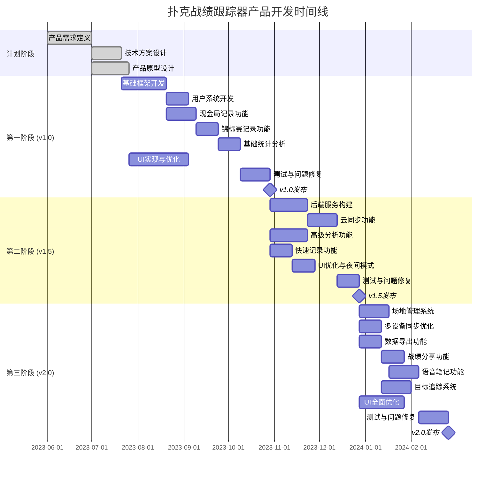

# 扑克战绩跟踪器 - 产品路线图 (Roadmap)

## 1. 路线图概述

本文档定义了"扑克战绩跟踪器"应用的开发和发布计划，包括主要版本、功能优先级和时间节点。路线图将根据市场反馈和业务需求进行定期更新。

### 产品发展愿景

"扑克战绩跟踪器"的发展愿景是从一款基础的战绩记录工具，逐步演进为扑克玩家的综合管理平台，融合记录、分析、学习和社交功能，成为每个扑克玩家的必备应用。

### 路线图制定原则

1. **价值优先**: 优先开发能为用户提供核心价值的功能
2. **渐进式发展**: 采用MVP策略，先发布核心功能，再迭代增强
3. **用户反馈驱动**: 根据用户反馈调整功能优先级和开发方向
4. **技术可行性平衡**: 平衡功能愿景与技术实现的复杂度
5. **市场竞争考量**: 关注竞品动态，优先发展差异化功能

## 2. 版本规划策略

### 发布周期

- **主要版本(Major)**: 每6个月一次
- **次要版本(Minor)**: 每1-2个月一次
- **补丁版本(Patch)**: 根据需要随时发布

### 版本命名规则

采用语义化版本号(Semantic Versioning)：`主版本号.次版本号.补丁号`

- **主版本号**: 重大功能变更或不兼容的API修改
- **次版本号**: 向后兼容的功能新增
- **补丁号**: 向后兼容的问题修复

### 质量门禁

每个版本发布前必须满足以下条件：
1. 所有P0级别功能的自动化测试通过率100%
2. 应用崩溃率小于0.1%
3. 所有高优先级bug修复完成
4. 性能指标满足要求（如启动时间≤3秒）
5. 安全审查通过

## 3. 详细版本规划

### v1.0 (MVP) - 初始核心版本
> 计划发布日期：项目启动后3个月

**核心目标**: 提供基础的战绩记录和简单分析功能，让用户能够便捷记录和查看自己的扑克战绩。

**主要功能**:
- 用户注册登录（包括第三方登录）
- 现金局战绩记录（基础字段）
- 锦标赛战绩记录（基础字段）
- 简单统计分析（总盈亏、场次等）
- 基础数据图表展示
- 本地数据存储
- 简单的用户设置

**平台支持**:
- iOS
- Android

**可交付成果**:
- 功能完整的iOS和Android应用
- 应用商店上线
- 基本用户指南

### v1.5 - 数据增强版
> 计划发布日期：v1.0发布后2个月

**核心目标**: 增强数据分析能力和用户体验，添加云同步功能。

**主要功能**:
- 云数据同步
- 高级数据分析（多维度分析）
- 增强的图表可视化
- 现金局和锦标赛记录字段扩展
- 快速记录功能
- 夜间模式
- 应用内引导流程优化

**技术增强**:
- 后端服务架构构建
- 数据同步冲突解决机制
- 性能优化

### v2.0 - 功能完善版
> 计划发布日期：v1.0发布后6个月

**核心目标**: 完善产品功能矩阵，提升用户粘性，准备盈利模式。

**主要功能**:
- 场地管理系统
- 多设备无缝同步
- 详细的数据导出功能
- 战绩分享到社交媒体
- 语音笔记记录
- 目标设定与追踪
- 个性化应用设置
- 完整的备份与恢复系统

**商业化准备**:
- 用户增长渠道建设
- 简单的应用内广告测试
- 用户行为分析系统完善

### v2.5 - 社区互动版
> 计划发布日期：v2.0发布后3个月

**核心目标**: 引入社区功能，增强用户互动，开始盈利模式。

**主要功能**:
- 基础社区功能（好友系统）
- 战绩排行榜
- 成就系统
- 手牌记录与分享
- 高级统计指标
- 鸿蒙OS平台支持
- 基础内购功能
- 定向推送通知

**商业化策略**:
- 推出基础的高级会员功能
- 优化广告展示策略
- 用户留存优化方案

### v3.0 - 专业分析版
> 计划发布日期：v2.0发布后6个月

**核心目标**: 提供专业级别的扑克分析工具，深化盈利模式。

**主要功能**:
- AI辅助分析（游戏模式识别、改进建议）
- 完整的社区功能（讨论区、活动）
- 高级图表和报表系统
- 锦标赛结构库
- 专业培训内容集成
- 多语言支持
- 高级数据导入工具
- 完整的高级会员体系

**商业化策略**:
- 完善的订阅模式
- 高级功能付费策略
- 合作伙伴计划（扑克培训、场地等）

## 4. 功能优先级矩阵

| 功能模块 | 功能点 | 优先级 | 计划版本 | 依赖关系 |
|---------|--------|-------|---------|---------|
| **用户账户** | 基础注册登录 | P0 | v1.0 | - |
| | 第三方登录 | P1 | v1.0 | 基础注册登录 |
| | 个人资料管理 | P1 | v1.0 | 基础注册登录 |
| | 云同步 | P0 | v1.5 | 基础注册登录, 后端服务 |
| | 多设备同步 | P1 | v2.0 | 云同步 |
| | 高级账户安全 | P2 | v2.5 | 基础注册登录 |
| **现金局记录** | 基础记录字段 | P0 | v1.0 | - |
| | 追加买入记录 | P0 | v1.0 | 基础记录字段 |
| | 详细笔记功能 | P1 | v1.5 | 基础记录字段 |
| | 语音笔记 | P2 | v2.0 | 详细笔记功能 |
| | 手牌记录 | P2 | v2.5 | 详细笔记功能 |
| | AI辅助记录 | P3 | v3.0 | 手牌记录 |
| **锦标赛记录** | 基础比赛信息 | P0 | v1.0 | - |
| | 再买入记录 | P0 | v1.0 | 基础比赛信息 |
| | 详细比赛结构 | P1 | v1.5 | 基础比赛信息 |
| | 锦标赛模板 | P2 | v2.5 | 详细比赛结构 |
| | 多级结构支持 | P3 | v3.0 | 锦标赛模板 |
| **数据分析** | 基础统计指标 | P0 | v1.0 | 基础记录功能 |
| | 简单图表展示 | P0 | v1.0 | 基础统计指标 |
| | 多维度分析 | P1 | v1.5 | 简单图表展示 |
| | 高级分析报表 | P2 | v2.0 | 多维度分析 |
| | 预测性分析 | P3 | v3.0 | 高级分析报表 |
| **快速记录** | 一键买入记录 | P1 | v1.5 | 基础记录功能 |
| | 快捷操作优化 | P2 | v2.0 | 一键买入记录 |
| | 智能语音助手 | P3 | v3.0 | 语音笔记 |
| **工具功能** | 基础设置 | P0 | v1.0 | - |
| | 场地管理 | P1 | v2.0 | 基础记录功能 |
| | 数据导出 | P1 | v2.0 | 基础统计指标 |
| | 目标追踪 | P2 | v2.0 | 基础统计指标 |
| | 积分计算器 | P2 | v2.5 | - |
| **社区功能** | 战绩分享 | P2 | v2.0 | 基础统计指标 |
| | 好友系统 | P2 | v2.5 | 云同步 |
| | 排行榜 | P2 | v2.5 | 好友系统 |
| | 讨论区 | P3 | v3.0 | 好友系统 |
| | 线下活动整合 | P3 | 未确定 | 讨论区 |
| **商业化** | 基础广告 | P2 | v2.5 | - |
| | 初级会员功能 | P2 | v2.5 | 云同步 |
| | 高级会员体系 | P3 | v3.0 | 初级会员功能 |
| | 高级功能解锁 | P3 | v3.0 | 高级会员体系 |
| **平台支持** | iOS | P0 | v1.0 | - |
| | Android | P0 | v1.0 | - |
| | 鸿蒙OS | P1 | v2.5 | - |
| | Web版 | P3 | 未确定 | 云同步 |

## 5. 详细时间线计划

## 6. 资源规划

### 开发团队配置

**第一阶段（v1.0）**:
- 前端开发: 2人（Flutter开发者）
- 后端开发: 1人（初始本地存储设计）
- UI/UX设计: 1人
- 测试: 1人
- 产品经理: 1人

**第二阶段（v1.5-v2.0）**:
- 前端开发: 2-3人
- 后端开发: 2人（云服务构建）
- UI/UX设计: 1人
- 测试: 1-2人
- 产品经理: 1人
- 数据分析: 1人（兼职）

**第三阶段（v2.5-v3.0）**:
- 前端开发: 3人
- 后端开发: 2-3人
- UI/UX设计: 1-2人
- 测试: 2人
- 产品经理: 1人
- 数据分析: 1人
- 市场/运营: 1-2人

### 基础设施规划

**第一阶段**:
- 基础开发环境
- 版本控制系统
- 简单的CI/CD流程
- 应用分发渠道

**第二阶段**:
- 云服务基础设施构建
- 数据库设计与部署
- 完善的CI/CD流程
- 监控与警报系统
- 用户反馈收集系统

**第三阶段**:
- 扩展云服务能力
- 数据分析平台
- A/B测试系统
- 完整的监控体系
- 社区管理工具

## 7. 风险管理

| 风险类别 | 风险描述 | 可能性 | 影响 | 缓解措施 |
|---------|--------|--------|-----|---------|
| **技术风险** | 跨平台框架对鸿蒙OS的支持不足 | 中 | 高 | 提前研究Flutter对鸿蒙的适配方案，必要时开发平台特定代码 |
| | 性能问题（大数据量下分析卡顿） | 高 | 中 | 数据分页加载，本地缓存优化，延迟计算策略 |
| | 云同步冲突处理复杂 | 中 | 高 | 设计完善的冲突解决策略，提供手动合并选项 |
| **市场风险** | 用户增长不及预期 | 中 | 高 | 加强ASO策略，寻找合作渠道，提升产品口碑 |
| | 竞品快速跟进核心功能 | 中 | 中 | 加快迭代速度，持续创新，构建品牌忠诚度 |
| | 用户留存率低 | 中 | 高 | 优化核心体验，增加用户激励，提高产品粘性 |
| **资源风险** | 开发资源不足 | 低 | 高 | 合理安排优先级，必要时调整发布计划 |
| | 服务器成本超出预期 | 低 | 中 | 优化架构，采用弹性扩展，控制数据存储 |
| **合规风险** | 应用商店政策变化 | 低 | 高 | 密切关注政策更新，预留调整方案 |
| | 数据隐私法规要求提高 | 中 | 中 | 提前做好合规设计，保持高于标准的隐私保护 |

### 应对策略
1. **定期风险评估**: 每月评估风险矩阵，调整应对措施
2. **快速原型验证**: 对高风险技术点提前进行概念验证
3. **灵活调整计划**: 根据市场反馈和技术实现情况调整路线图
4. **预留缓冲时间**: 在关键里程碑设定合理缓冲，应对不可预见因素
5. **密切跟踪用户反馈**: 建立快速反馈循环，及时调整产品方向

## 关键决策点

1. **v1.5后用户增长评估**: 根据初期用户增长情况决定是否调整市场策略
2. **v2.0前商业化时机评估**: 根据用户规模和参与度决定商业化启动时机
3. **v2.5平台扩展决策**: 根据市场情况评估鸿蒙OS支持的优先级
4. **v3.0前高级功能投入决策**: 根据用户数据使用情况，决定AI分析等高级功能的投入程度 