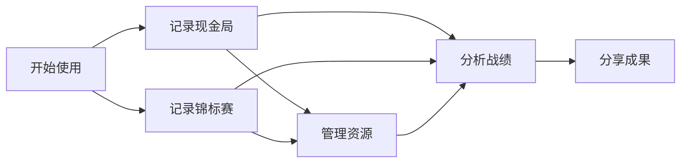

# 扑克战绩跟踪器 - 用户故事地图 (User Story Map)

## 1. 用户故事地图概述

用户故事地图是一种视觉化工具，用于从用户角度组织和安排产品需求。本文档将扑克战绩跟踪器的功能需求按照用户活动流程组织，并按照优先级进行垂直分解，以指导产品的迭代开发。

### 1.1 地图结构说明

* **横向**: 表示用户使用产品的主要活动流程，按时间顺序从左到右排列
* **纵向**: 表示每个活动中的具体任务和故事，从上到下按照优先级排序
* **版本划分**: 横跨活动的横线将故事分为不同版本，表示产品迭代计划

### 1.2 优先级说明

* **P0**: 必要功能，MVP的基础组成部分
* **P1**: 重要功能，能够明显提升用户体验
* **P2**: 增强功能，能够丰富产品功能矩阵
* **P3**: 未来功能，作为长期规划考虑

## 2. 用户活动流 (横向)

用户在使用扑克战绩跟踪器过程中的主要活动流如下：



### 主要活动说明

1. **开始使用**: 用户首次接触应用，完成注册登录、了解产品功能
2. **记录现金局**: 记录现金游戏的详细信息，包括买入、带出等数据
3. **记录锦标赛**: 记录比赛的详细信息，包括买入、名次、奖金等
4. **分析战绩**: 查看和分析历史战绩数据，了解自己的表现
5. **分享成果**: 将战绩数据以适当形式分享给其他人
6. **管理资源**: 管理个人资料、场地信息等辅助资源

## 3. 用户任务分解 (纵向)

### 3.1 开始使用

#### 核心任务 (P0)
1. **注册与登录**
   - 作为新用户，我希望能快速创建账户，以便开始使用应用
   - 作为现有用户，我希望能方便地登录应用，以便访问我的数据
   - 作为用户，我希望能跳过注册直接体验应用，以便评估是否适合我

2. **了解产品功能**
   - 作为新用户，我希望能看到简短的功能介绍，以便快速理解产品价值
   - 作为新用户，我希望获得基本的使用引导，以便正确使用各项功能

#### 增强任务 (P1)
1. **个人设置**
   - 作为用户，我希望设置我的扑克玩家资料，以便记录更加个性化
   - 作为用户，我希望调整应用的基本设置（如货币符号），以符合我的使用习惯

2. **第三方登录**
   - 作为用户，我希望使用社交账号（Google/Apple/微信）登录，以简化注册登录流程
   - 作为用户，我希望可以在多平台间同步我的账号，以便在不同设备上使用

#### 未来任务 (P2-P3)
1. **高级账户管理** (P2)
   - 作为用户，我希望强化账户安全（如双重认证），以保护我的数据安全
   - 作为用户，我希望管理我的订阅和支付信息，以便控制我的消费

2. **个性化体验** (P2)
   - 作为用户，我希望选择应用的主题和外观，以提升使用体验
   - 作为用户，我希望定制应用的启动页面和默认视图，以便更高效地使用

### 3.2 记录现金局

#### 核心任务 (P0)
1. **创建现金局记录**
   - 作为玩家，我希望快速创建新的现金局记录，以便记录即将开始的游戏
   - 作为玩家，我希望记录基本的游戏信息（地点、日期、游戏类型、盲注），以便区分不同的游戏

2. **记录买入信息**
   - 作为玩家，我希望记录初始买入金额，以便追踪我的投资
   - 作为玩家，我希望记录追加买入金额和时间，以便完整追踪所有投资
   - 作为玩家，我希望记录带出筹码金额，以便计算盈亏

3. **完成游戏记录**
   - 作为玩家，我希望记录游戏的开始和结束时间，以便计算游戏时长
   - 作为玩家，我希望查看自动计算的盈亏结果，以便了解游戏成果
   - 作为玩家，我希望标记记录完成的状态，以区分进行中和已完成的游戏

#### 增强任务 (P1)
1. **快速记录**
   - 作为玩家，我希望在游戏进行中快速记录追加买入，以不打断游戏体验
   - 作为玩家，我希望使用语音录入笔记和关键信息，以便快速记录

2. **详细笔记记录**
   - 作为玩家，我希望记录游戏中的特殊情况和观察，以便回顾和学习
   - 作为玩家，我希望对表现进行自评和评级，以便追踪心态和表现

3. **模板与快捷选项**
   - 作为玩家，我希望使用常用场地和游戏类型的快捷选项，以加快记录过程
   - 作为玩家，我希望基于历史记录自动填充某些字段，以减少重复输入

#### 未来任务 (P2-P3)
1. **手牌记录** (P2)
   - 作为玩家，我希望记录重要手牌的详情，以便回顾和分析
   - 作为玩家，我希望使用可视化工具记录牌局，而不只是文字描述

2. **高级记录功能** (P3)
   - 作为玩家，我希望拍照记录桌面情况，以便更全面地记录游戏
   - 作为玩家，我希望获得AI辅助分析记录的手牌，以提供策略建议

### 3.3 记录锦标赛

#### 核心任务 (P0)
1. **创建锦标赛记录**
   - 作为玩家，我希望创建新的锦标赛记录，以便记录参赛信息
   - 作为玩家，我希望记录比赛基本信息（赛事名称、日期、地点、比赛类型），以区分不同比赛

2. **记录买入与结果**
   - 作为玩家，我希望记录买入金额（含服务费），以追踪投资
   - 作为玩家，我希望记录再买入(Re-buy)和附加买入(Add-on)，以完整计算总投资
   - 作为玩家，我希望记录最终名次和奖金，以计算比赛回报

3. **完成比赛记录**
   - 作为玩家，我希望记录比赛持续时间，以评估时间投入
   - 作为玩家，我希望查看自动计算的ROI，以评估比赛表现
   - 作为玩家，我希望标记比赛状态（进行中/已完成），以区分当前状态

#### 增强任务 (P1)
1. **详细赛事记录**
   - 作为玩家，我希望记录参赛人数和奖池结构，以便全面了解比赛情况
   - 作为玩家，我希望记录关键阶段（如泡钱圈、决赛桌）的信息，以分析关键点表现
   - 作为玩家，我希望添加比赛过程中的笔记和观察，以便回顾和学习

2. **多日比赛支持**
   - 作为玩家，我希望记录跨多天的比赛情况，以便管理长期赛事
   - 作为玩家，我希望设置比赛提醒，以免错过后续比赛日程

3. **卫星赛记录**
   - 作为玩家，我希望记录卫星赛（Satellite）特有信息，如资格赛名额价值
   - 作为玩家，我希望将卫星赛与主赛事关联，以全面计算ROI

#### 未来任务 (P2-P3)
1. **锦标赛模板** (P2)
   - 作为玩家，我希望创建和使用常规锦标赛的模板，以加快记录
   - 作为玩家，我希望应用可以提供常见锦标赛结构的选项，减少输入工作

2. **高级锦标赛功能** (P3)
   - 作为玩家，我希望跟踪定期锦标赛系列的整体表现，如周赛、月赛系列
   - 作为玩家，我希望获取比赛策略建议，以优化下次参赛表现

### 3.4 分析战绩

#### 核心任务 (P0)
1. **查看总体概览**
   - 作为玩家，我希望查看总盈亏金额，以便了解整体表现
   - 作为玩家，我希望查看按时间段（天/周/月/年）的盈亏情况，以便跟踪趋势
   - 作为玩家，我希望查看基本统计数据（总场次、胜率等），以评估整体表现

2. **查看历史记录**
   - 作为玩家，我希望浏览所有历史记录，以回顾过往游戏
   - 作为玩家，我希望查看单场游戏的详细信息，以分析具体表现
   - 作为玩家，我希望搜索和筛选历史记录，以快速找到特定记录

#### 增强任务 (P1)
1. **多维度分析**
   - 作为玩家，我希望按游戏类型分析盈亏，以识别最适合我的游戏
   - 作为玩家，我希望按地点分析盈亏，以识别最有利的场地
   - 作为玩家，我希望按盲注级别分析盈亏，以找到最适合我的级别
   - 作为玩家，我希望按时间段（如每天时段）分析盈亏，以找到最佳游戏时间

2. **关键指标展示**
   - 作为玩家，我希望查看每小时收益率，以评估时间价值
   - 作为玩家，我希望查看锦标赛ROI，以评估投资回报
   - 作为玩家，我希望查看大盲注每小时盈利（BB/hour），以评估技术水平

3. **图表可视化**
   - 作为玩家，我希望通过图表直观查看盈亏趋势，以识别模式
   - 作为玩家，我希望通过饼图查看不同维度的盈亏分布，以全面了解表现
   - 作为玩家，我希望查看累计盈亏曲线，以了解长期表现走势

#### 未来任务 (P2-P3)
1. **高级分析与报表** (P2)
   - 作为玩家，我希望查看详细的会话分析报告，以深入了解每场游戏
   - 作为玩家，我希望创建自定义报表，以关注我最关心的指标
   - 作为玩家，我希望设置目标并跟踪进度，以促进自我提升

2. **预测性分析** (P3)
   - 作为玩家，我希望基于历史数据预测未来表现，以制定更好的策略
   - 作为玩家，我希望获得AI辅助分析，发现我未注意到的模式
   - 作为玩家，我希望进行假设情景分析，以评估不同策略的潜在效果

### 3.5 分享成果

#### 核心任务 (P0)
1. **生成基本报告**
   - 作为玩家，我希望查看我的战绩摘要，以便了解我的表现
   - 作为玩家，我希望保存战绩数据，以便安全存储我的历史记录

#### 增强任务 (P1)
1. **导出功能**
   - 作为玩家，我希望导出数据为CSV/Excel，以便在其他工具中分析
   - 作为玩家，我希望导出图表和报告为图片，以便在其他平台使用

2. **分享功能**
   - 作为玩家，我希望创建可分享的战绩卡片，以在社交媒体展示
   - 作为玩家，我希望分享单场战绩或阶段性成果，以获得反馈

#### 未来任务 (P2-P3)
1. **社区分享** (P2)
   - 作为玩家，我希望将战绩分享到应用内社区，以与其他玩家交流
   - 作为玩家，我希望参与排行榜和挑战，以增加竞争乐趣

2. **专业展示** (P3)
   - 作为职业玩家，我希望创建专业战绩展示页面，以向赞助商或粉丝展示
   - 作为职业玩家，我希望将战绩数据整合到我的个人网站，以塑造个人品牌

### 3.6 管理资源

#### 核心任务 (P0)
1. **管理个人设置**
   - 作为用户，我希望管理我的账户信息，以保持数据准确
   - 作为用户，我希望设置应用的基本选项，以符合个人偏好

#### 增强任务 (P1)
1. **场地管理**
   - 作为玩家，我希望创建和管理常用场地信息，以便快速选择
   - 作为玩家，我希望为场地添加评分和笔记，以记录场地特点

2. **数据管理**
   - 作为用户，我希望备份我的数据，以防丢失
   - 作为用户，我希望恢复数据备份，以便在新设备上继续使用
   - 作为用户，我希望管理云同步设置，以控制数据使用

#### 未来任务 (P2-P3)
1. **扑克工具集** (P2)
   - 作为玩家，我希望使用筹码计算器，以辅助游戏决策
   - 作为玩家，我希望使用赔率计算器，以进行概率分析

2. **资源整合** (P3)
   - 作为玩家，我希望访问扑克学习资源，以提升技能
   - 作为玩家，我希望整合线上平台数据，以全面分析我的表现

## 4. 故事优先级与版本映射

### v1.0 (MVP) - 基础记录与分析

**开始使用**:
- 基本注册登录 (P0)
- 简单产品引导 (P0)

**记录现金局**:
- 创建现金局记录 (P0)
- 记录买入信息 (P0)
- 完成游戏记录 (P0)

**记录锦标赛**:
- 创建锦标赛记录 (P0)
- 记录买入与结果 (P0)
- 完成比赛记录 (P0)

**分析战绩**:
- 查看总体概览 (P0)
- 查看历史记录 (P0)
- 简单图表展示 (P0)

**管理资源**:
- 管理个人设置 (P0)

### v1.5 - 增强体验版

**开始使用**:
- 个人设置 (P1)
- 第三方登录 (P1)

**记录现金局**:
- 快速记录功能 (P1)
- 详细笔记记录 (P1)
- 模板与快捷选项 (P1)

**记录锦标赛**:
- 详细赛事记录 (P1)
- 多日比赛支持 (P1)

**分析战绩**:
- 多维度分析 (P1)
- 关键指标展示 (P1)
- 图表可视化增强 (P1)

**分享成果**:
- 导出功能 (P1)

**管理资源**:
- 数据备份与恢复 (P1)

### v2.0 - 功能完善版

**记录现金局**:
- 语音笔记功能 (P2)

**记录锦标赛**:
- 卫星赛记录 (P1)

**分析战绩**:
- 高级分析与报表初版 (P2)
- 目标设定与跟踪 (P2)

**分享成果**:
- 分享功能 (P1)
- 战绩卡片生成 (P1)

**管理资源**:
- 场地管理 (P1)
- 完整数据管理 (P1)

### v2.5 及更高版本

**开始使用**:
- 高级账户管理 (P2)
- 个性化体验 (P2)

**记录现金局**:
- 手牌记录 (P2)
- 高级记录功能 (P3)

**记录锦标赛**:
- 锦标赛模板 (P2)
- 高级锦标赛功能 (P3)

**分析战绩**:
- 完整高级分析 (P2)
- 预测性分析 (P3)

**分享成果**:
- 社区分享 (P2)
- 专业展示 (P3)

**管理资源**:
- 扑克工具集 (P2)
- 资源整合 (P3)

## 5. 用户故事地图可视化

```
+------------------------------------------------------------------------------------------------+
|                                     扑克战绩跟踪器用户故事地图                                    |
+------------------------------------------------------------------------------------------------+
|                                                                                                |
|   开始使用        记录现金局        记录锦标赛        分析战绩         分享成果        管理资源     |
|                                                                                                |
+------------------------------------------------------------------------------------------------+
|  注册与登录      创建现金局记录    创建锦标赛记录    查看总体概览    生成基本报告    管理个人设置   |
|  了解产品功能    记录买入信息     记录买入与结果    查看历史记录                                |
|                完成游戏记录      完成比赛记录                                                 |
|                                                                                                |
|--------------------------------- v1.0 (MVP) - 基础记录与分析 -----------------------------------| 
|                                                                                                |
|  个人设置        快速记录功能     详细赛事记录      多维度分析       导出功能        数据管理     |
|  第三方登录      详细笔记记录     多日比赛支持      关键指标展示                                |
|                模板与快捷选项                     图表可视化                                   |
|                                                                                                |
|------------------------------------ v1.5 - 增强体验版 -----------------------------------------| 
|                                                                                                |
|                语音笔记功能      卫星赛记录        高级分析初版     分享功能        场地管理     |
|                                                 目标设定与跟踪    战绩卡片生成     完整数据管理  |
|                                                                                                |
|------------------------------------ v2.0 - 功能完善版 -----------------------------------------| 
|                                                                                                |
|  高级账户管理    手牌记录         锦标赛模板       完整高级分析     社区分享        扑克工具集   |
|  个性化体验      高级记录功能     高级锦标赛功能    预测性分析      专业展示        资源整合     |
|                                                                                                |
|-------------------------------- v2.5及以上 - 高级功能版 --------------------------------------| 
|                                                                                                |
+------------------------------------------------------------------------------------------------+
```

## 6. 迭代与更新机制

用户故事地图将随着产品迭代和用户反馈定期更新。更新机制如下：

1. **版本回顾**: 每个版本发布后进行回顾，检视用户故事的完成情况
2. **用户反馈整合**: 基于用户反馈调整现有故事优先级或添加新故事
3. **市场变化响应**: 根据市场趋势和竞品变化调整故事内容
4. **季度地图更新**: 每季度正式更新一次用户故事地图，确保与产品路线图同步
5. **新版本规划**: 在规划新版本前，组织专门会议重新评估用户故事的优先级 